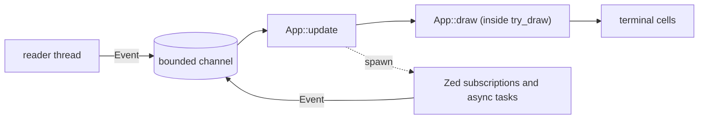

# Architecture

## Goal

zec runs Zed's `editor::Editor` in a terminal. Zed owns editing. zec does
three things and nothing else: it translates terminal input into Zed input
and zec commands, it projects Zed snapshots and zec presentation state onto
terminal cells, and it wires Zed services together.

Zed's crates are consumed as pinned Git dependencies from an independent
binary crate. There is no fork; a private Zed API is not a reason to start
one until nothing else works.

## Principles

1. **Zed is the authority.** Text, selections, undo, files, languages,
   search results, git state, processes: whatever Zed has a model for, zec
   holds the Zed entity and never a parallel model. zec state is
   presentation and routing only.
2. **All zec state is one explicit tree** rooted at `App`. No state lives in
   loop locals, closures, or globals.
3. **One event type, one update, one draw.** Everything that can change
   `App` arrives as an `Event` and passes through `App::update`. Async
   results and Zed notifications re-enter as events keyed by the entity
   they belong to; `update` drops the ones zec no longer owns.
4. **Input routing is explicit.** A focus stack decides who sees an input
   first, and each owner answers `Consumed`, `Ignored`, or a `Command`.
   Nothing is decided by the order of match arms.
5. **Commands are the only way to do things.** Every user-invocable
   operation is a `Command`. Keys reach commands through Zed's keymap, the
   palette lists the same commands, and `update` executes them. There is no
   key predicate outside the keymap.
6. **Features are leaves of one shape.** A feature owns its state, events,
   commands, input handling, and drawing. Only the composition in `app`
   knows a feature exists; the loop, the terminal layer, the Zed layer, and
   other features do not.
7. **Prompts, pickers, and confirmations are one mechanism**: an overlay on
   the focus stack. There are no per-feature `Option<XxxPrompt>` fields and
   no `*_armed` flags.

## Layout

| Path | Owns | May import |
| --- | --- | --- |
| `src/main.rs` | process entry, dispatch of the parsed CLI | `app`, `cli`, `zed` |
| `src/cli.rs` | argument parsing, `ZEC_DATA_DIR` | `paths` |
| `src/app/` | `App`, `Event`, `Command`, overlays, documents, the tab list, `update`, `draw`, the loop | everything |
| `src/terminal/` | raw mode and restore, capability detection, reader thread, key translation, cell widgets, line prompt, picker list, clipboard | Ratatui, Crossterm |
| `src/zed/` | GPUI boot, `Project` and stores, hidden Editor windows, snapshot capture, subscriptions, keymap lookup, config watchers, `--smoke` | Zed crates |
| `src/features/<name>/` | one feature | `app` contract types, `terminal`, `zed` |

`app/feature.rs`, `app/update.rs`, and `app/draw.rs` are the only files
that name a feature. `terminal` and `zed` never import `app` or `features`: their
event types are converted with `From` by the `app` sender.

## The loop



```rust
app.draw_frame(&mut terminal, cx)?;
loop {
    let event = events.recv().await?;
    match app.update(event, cx).await? {
        Flow::Continue => {}
        Flow::Suspend => terminal::suspend_and_resume(&mut terminal, &app.capabilities)?,
        Flow::Exit => break,
    }
    app.draw_frame(&mut terminal, cx)?;
}
```

One draw per event; `Redraw` events coalesce in the channel, so a burst of
Zed notifications costs one frame. Nothing polls Zed: every Zed-side change
that should repaint or change zec state is a subscription installed when
the document opens, forwarding an `Event`.

## State

```rust
struct App {
    services: Services,          // Project, BufferStore, WorktreeStore, Fs, languages
    events: Sender<Event>,       // handed to subscriptions and async tasks
    pending_commands: Rc<RefCell<Vec<Command>>>, // filled by the GPUI action interceptor
    keymap: Rc<RefCell<Lookup>>, // Zed keymap for owners without a window
    capabilities: Capabilities,  // detected at startup, refined by observed input
    cwd: PathBuf,
    root: Option<PathBuf>,       // the visible worktree root, when a directory was opened
    workspace: WorkspaceModel,   // ordered tab list plus the active tab; reducer with invariants
    documents: Documents,        // ItemId -> Document
    overlays: Overlays,          // stack; the top owns focus while it is a prompt or picker
    status: Status,              // one transient message
    frame: Option<Frame>,        // the last drawn frame, for mouse hit testing and scrolling
    resize: Option<ResizeAcknowledgement>, // released after the first frame after a resize
    needs_invalidate: bool,
}

struct Document {
    buffer: Entity<Buffer>,
    editor: WindowHandle<Editor>, // one hidden GPUI window per tab
    viewport: Viewport,           // top row, left column
    follow: Follow,               // whether the viewport follows the cursor
    untitled: Option<String>,     // label of a scratch buffer
}
```

Label, dirty state, disk state, and save eligibility derive from
`Buffer::file()` at use time and are never cached. In debug builds every
`update` ends with the whole tree checked: tab ids are unique, the active
index is valid, every tab has a document, every overlay references live
state. Splits (two tabs on one Buffer) and docks return with feature 6 and
extend `WorkspaceModel` rather than adding a second model.

## Events

```rust
enum Event {
    Input(Input),              // Key, Paste, Mouse, Scroll
    Resize(ResizeAcknowledgement),
    Redraw,
    FocusChanged(bool),
    Signal(i32),
    Fatal(String),             // the reader thread stopped
    Document(DocumentEvent),   // ReloadFinished { buffer_id, result }
    Config(ConfigEvent),       // settings or keymap file reloaded
}
```

`terminal::Event` and `zed::Event` convert into `Event` with `From`, so
the reader thread and the Zed subscriptions send through a generic
`Sender<T>` without knowing `app`. An asynchronous completion carries the
id of the entity it belongs to; the receiver ignores ids it no longer owns.
A feature whose completions can outlive a prompt or a tab adds a
generation to its own event.

## Commands and keys

```rust
commands! {
    CommandPalette => "Command Palette",
    NewFile => "New File",
    ...
}
// expands to `enum Command`, `mod actions` (one GPUI action per variant in
// the `zec` namespace), `Command::ALL`, `action_name()`, `label()`, and
// `from_action_name()`.
```

Every `Command` is a GPUI action. The default keymap in Zed's JSON format
(`app/keymap.json`) is compiled into the binary; Zed's own defaults load
first and the user's `keymap.json` overrides both. For a document owner the
key is dispatched to its hidden window, Zed's keymap resolves it, and an
interceptor registered with `cx.on_action` pushes a dispatched zec action
into `pending_commands`. The queue is drained right after the dispatch
returns, so a command runs before the next key: GPUI action handlers run
synchronously, and a channel round-trip would reorder them against later
input. Overlay owners have no window, so their keys are resolved with
`Keymap::bindings_for_input` in the `zec_overlay` context; an unbound key
is offered to the overlay as raw input. The palette lists `Command::ALL`.
A feature's commands are lines in the same `commands!` block; `execute`
dispatches them to the feature.

## Focus and overlays

The focus stack is the active document plus the overlay stack. Key and
paste input goes to the top owner; a prompt or picker consumes everything,
a confirmation consumes nothing. Mouse input goes to the document under
the last frame. An overlay answers a key with:

```rust
enum OverlayOutcome { Consumed, Submit(String), Cancel, Command(Command) }
```

```rust
enum Overlay {
    Prompt  { label, line: LinePrompt, target: PromptTarget, feedback },        // Save As, Open
    Picker  { title, query: LinePrompt, list: PickerList<PickerPayload>, owner }, // palette, Quick Open
    Confirm { message, command: Command },
}
```

A picker's `owner` refreshes its entries when the query changes: the
palette filters its fixed entries in place, and a feature-owned picker
asks its feature, which replaces the entries when its match completes.
`Esc` pops the top overlay. Every overlay is bound to the active tab and
closes when that tab changes. `Confirm` replaces every second-press flag:
`execute` settles a pending confirmation in one place, so repeating the
confirmed command carries `confirmed = true` and any other command
dismisses it. Quit and close with dirty documents, reload of a dirty
document, save over an external change, and overwrite on Save As all use
it.

## Draw

`App::draw` runs inside Ratatui's `try_draw` callback so the frame area,
cursor follow, clipping, and snapshot capture happen in one step and cannot
race a resize:

1. The active document sets the Editor's wrap width to the body width,
   follows the cursor, clamps the viewport, and reads only
   `[top_row, top_row + height)` from Zed's `DisplaySnapshot`. The
   viewport is the only state `draw` mutates and the wrap width the only
   Zed write.
2. `EditorWidget` renders the snapshot; the status row shows the tab
   strip and key hints, or the transient message, or the top overlay's
   presentation (a prompt line or a bounded picker list).
3. The frame is stored for mouse hit testing. Everything is projected onto
   visible cells only; the terminal never recomputes folds, wraps, or
   highlights.

Panes, docks, and a render plan return with feature 6.

## Feature contract

```rust
// src/features/<name>/mod.rs
#[derive(Default)]
pub struct <Name>;                      // the feature's state
pub enum <Name>Event;                   // completions of spawned work, generation-tagged

impl <Name> {
    pub fn <command>(&mut self, ctx: &mut Ctx, cx: &mut AsyncApp);   // one per command
    pub fn update(&mut self, ctx: &mut Ctx, event: <Name>Event);
    pub fn query_changed(&mut self, ctx: &mut Ctx, query: &str, cx: &mut AsyncApp); // if it owns a picker
}

// src/app/feature.rs
pub struct Ctx<'a> { services, root, overlays, status, events }
pub struct Features { pub <name>: <Name>, ... }
pub enum FeatureEvent { <Name>(<Name>Event), ... }
```

`Ctx` is a feature's only access to the rest of zec. A feature never
touches another feature's state; a cross-feature effect is a `Command`.
Work a feature spawns completes as its own event through `events`, tagged
with the generation that requested it, and `update` drops stale
generations.

Adding a feature touches exactly: its directory, a line per command in
`commands!`, a `Features` field, a `FeatureEvent` variant, and the dispatch
arms in `app/update.rs` (command, event, and picker owner when it has one).
A feature that draws its own region adds a `view` and an arm in
`app/draw.rs`. Removing a feature reverses those. A feature's Zed crate
dependencies enter `Cargo.toml` together with the feature.

## Terminal boundary

- The session enters raw mode, the alternate screen, mouse capture, focus
  events, bracketed paste, and the detected keyboard protocol at startup,
  and restores all of them on every exit path. Restoration attempts every
  step even when one fails and reports the first failure. Signal handlers
  set an atomic flag; the reader thread turns it into `Event::Signal`, and
  `SIGTSTP` becomes `Flow::Suspend`.
- The reader thread does blocking Crossterm reads and starts only after raw
  mode is active. Input events apply backpressure to preserve order;
  `Redraw` uses `try_send`. The reader coalesces resize bursts and polls
  the size at low frequency for PTYs that miss resize events.
- Exactly one layer converts Zed's UTF-8 byte columns to grapheme cell
  widths; the mouse hit test is its inverse.
- The clipboard is OSC 52 only: copy payloads come from Zed's public
  selections, are capped at 256 KiB, and Cut dispatches Zed's action only
  after the write.

## Zed boundary

- GPUI runs headless on Linux and native with hidden windows on Windows.
- Files go through `RealFs -> WorktreeStore -> BufferStore` under one
  `Project::local`; zec never writes files itself. Repository mode has one
  visible worktree; direct file mode uses invisible worktrees so external
  renames stay tracked. Save formats through `Project::format` with the
  save trigger first, as Zed's editor does, so on-save whitespace and
  newline rules apply.
- Native grammars are registered as lazy loaders; languages compile their
  queries on first use.
- `zed/editor.rs` holds the helpers that turn Zed entity events into zec
  events, capture display snapshots, and dispatch keystrokes and actions
  into the hidden window.

## Verification

- `Services`, the editor helpers, and the clipboard run under headless
  GPUI with real Buffers and no PTY. Tree invariants are asserted after
  every update in debug builds.
- Contract tests: action names are unique and round-trip, and every zec
  binding in the default keymap resolves to a registered command.
- The actual binary runs through a PTY (`tests/e2e.rs`) for lifecycle (raw
  mode restore, signals, resize, first frame), edit and save, tabs and the
  palette, external change handling, and one scenario per feature.
