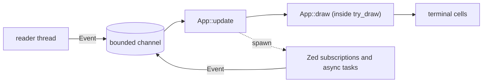

# Architecture

## Goal

zec runs Zed's `editor::Editor` in a terminal. Zed owns editing. zec does
three things and nothing else: it translates terminal input into Zed input
and zec commands, it projects Zed snapshots and zec presentation state onto
terminal cells, and it wires Zed services together.

Zed's crates are consumed as pinned Git dependencies from an independent
binary crate. There is no fork; a private Zed API is not a reason to start
one until nothing else works.

## Principles

1. **Zed is the authority.** Text, selections, undo, files, languages,
   search results, git state, processes: whatever Zed has a model for, zec
   holds the Zed entity and never a parallel model. zec state is
   presentation and routing only.
2. **All zec state is one explicit tree** rooted at `App`. No state lives in
   loop locals, closures, or globals.
3. **One event type, one update, one draw.** Everything that can change
   `App` arrives as an `Event` and passes through `App::update`. Async
   results and Zed notifications re-enter as events tagged with the
   generation that requested them; `update` drops stale generations.
4. **Input routing is explicit.** A focus stack decides who sees an input
   first, and each owner answers `Consumed`, `Ignored`, or a `Command`.
   Nothing is decided by the order of match arms.
5. **Commands are the only way to do things.** Every user-invocable
   operation is a `Command`. Keys reach commands through Zed's keymap, the
   palette lists the same commands, and `update` executes them. There is no
   key predicate outside the keymap.
6. **Features are leaves of one shape.** A feature owns its state, events,
   commands, input handling, and drawing. Only the composition in `app`
   knows a feature exists; the loop, the terminal layer, the Zed layer, and
   other features do not.
7. **Prompts, pickers, and confirmations are one mechanism**: an overlay on
   the focus stack. There are no per-feature `Option<XxxPrompt>` fields and
   no `*_armed` flags.

## Layout

| Path | Owns | May import |
| --- | --- | --- |
| `src/main.rs` | CLI parsing, process setup, `--smoke` | `app`, `cli` |
| `src/app/` | `App`, `Event`, `Command`, focus, overlays, `update`, `draw`, the loop | everything |
| `src/terminal/` | raw mode and restore, capability detection, reader thread, cell widgets, coordinate conversion, clipboard | Ratatui, Crossterm |
| `src/zed/` | GPUI boot, `Project` and stores, hidden Editor windows, snapshot capture, subscription helpers | Zed crates |
| `src/features/<name>/` | one feature | `app` contract types, `terminal`, `zed` |

`app/update.rs` and `app/draw.rs` are the only files that name a feature.
`terminal` and `zed` never import `app` or `features`.

## The loop



```rust
loop {
    let event = events.recv().await;
    app.update(event, cx);
    terminal.try_draw(|frame| app.draw(frame, cx))?;
}
```

One draw per event; `Redraw` events coalesce in the channel, so a burst of
Zed notifications costs one frame. Nothing polls Zed: every Zed-side change
that should repaint or change zec state is a subscription installed when
the owning feature starts, forwarding an `Event`.

## State

```rust
struct App {
    terminal: TerminalState,   // capabilities, last known size, last frame plan
    workspace: WorkspaceModel, // panes, items, docks, base focus; reducer with invariants
    documents: Documents,      // ItemId -> Document
    overlays: Overlays,        // stack; the top owns focus while non-empty
    status: Status,            // one transient message
    features: Features,        // one field per feature, None until started
}

struct Document {
    buffer: Entity<Buffer>,
    editor: WindowHandle<Editor>, // one hidden GPUI window per item
    viewport: Viewport,           // top row, left column, follow state
}
```

Two items may show one Buffer (a split); each has its own Editor. Label,
dirty state, disk state, and save eligibility derive from `Buffer::file()`
at use time and are never cached. `WorkspaceModel` keeps its reducer and
invariant check; in debug builds and tests every `update` ends with the
whole tree checked: layout leaves match the pane map, items are unique,
focus and overlays reference live ids, every item has a document.

## Events

```rust
enum Event {
    Input(Input),              // Key, Paste, Mouse, Scroll
    Resize,
    Redraw,
    FocusChanged(bool),
    Signal(i32),
    Command(Command),          // keymap dispatch, palette, or another feature
    Document(DocumentEvent),   // Reparsed, ReloadFinished, DiskStateChanged, ... keyed by buffer id
    Feature(FeatureEvent),     // one variant per feature wrapping that feature's Event
}
```

Every asynchronous completion carries the id and generation of the request
that produced it. The receiver compares with its current generation and
drops the rest, so a stale completion can never publish into a newer
prompt, tab, or search.

## Commands and keys

```rust
enum Command { Quit, Save, SaveAs, Close, NextItem, ..., Feature(FeatureCommand) }

struct CommandSpec {
    command: Command,
    action: &'static str,     // GPUI action name in the `zec` namespace
    label: &'static str,      // palette text
    available: fn(&App) -> bool,
}
```

Every `Command` is a GPUI action. A default keymap in Zed's JSON format is
compiled into the binary and the user's `keymap.json` overrides it. For a
document owner the key is dispatched to its hidden window, Zed's keymap
resolves it, and an interceptor turns a dispatched zec action into
`Event::Command`. Overlay and panel owners have no window, so their keys
are resolved with `Keymap::bindings_for_input` in the owner's key context;
an unbound key is offered to the owner as raw input. The palette is
`commands()` filtered by `available`. A feature registers commands by
exposing its `CommandSpec`s; nothing else is needed for palette or keymap.

## Focus and overlays

```rust
enum Focus { Item(ItemId), Dock(PanelKind), Overlay(OverlayId) }
```

The stack is the workspace base focus (an item or a dock panel) plus the
overlay stack. Key and paste input goes to the top; mouse input goes to the
owner of the hit region in the last frame plan. An owner's
`handle_input` returns:

```rust
enum InputOutcome { Consumed, Ignored, Command(Command) }
```

`Ignored` falls through to the next owner. The bottom owner is always a
document or panel and consumes everything.

```rust
enum Overlay {
    Prompt  { label, line: LinePrompt, target: PromptTarget },             // Save As, Open, Go to line, search query
    Picker  { query: LinePrompt, list: PickerList, target: PickerTarget }, // palette, Quick Open, themes, tasks
    Confirm { message, command: Command },                                 // the same command again executes, anything else dismisses
    Feature(FeatureOverlay),                                               // feature-owned, e.g. completion menu or hover
}
```

`Esc` pops the top overlay. An overlay bound to an item closes when that
item changes. `Confirm` replaces every second-press flag: quit and close
with dirty documents, reload of a dirty document, save over a conflict,
overwrite on Save As.

## Draw

`App::draw` runs inside Ratatui's `try_draw` callback so the frame area,
cursor follow, clipping, and snapshot capture happen in one step and cannot
race a resize:

1. `workspace_render::render_plan` assigns non-overlapping rects to panes,
   docks, tab strip, and status; the plan is stored for mouse hit testing.
2. Each visible document sets the Editor's wrap width to its pane width,
   follows the cursor, clamps the viewport, and reads only
   `[top_row, top_row + height)` from Zed's `DisplaySnapshot`. The
   viewport is the only state `draw` mutates and the wrap width the only
   Zed write.
3. Widgets render document snapshots, feature panels, overlays, and the
   status row. Everything is projected onto visible cells only; the
   terminal never recomputes folds, wraps, or highlights.

## Feature contract

```rust
// src/features/<name>/mod.rs
pub struct State;
pub enum Event;                 // completions and Zed notifications, generation-tagged
pub enum Command;               // user-invocable operations

pub fn commands() -> &'static [CommandSpec];
pub fn start(ctx: &mut Ctx) -> Result<State>;                        // subscriptions, initial reads
pub fn update(state: &mut State, ctx: &mut Ctx, event: Event);
pub fn execute(state: &mut State, ctx: &mut Ctx, command: Command);
pub fn handle_input(state: &mut State, ctx: &mut Ctx, input: &Input) -> InputOutcome; // if it owns focus
pub fn view(state: &State, ctx: &ViewCtx, area: Rect, buf: &mut Buffer);            // if it draws
```

`Ctx` is a feature's only access to the rest of zec: the Zed services
(`Project`, `BufferStore`, `WorktreeStore`), `documents`, a read view of
`workspace`, `status`, `overlays`, the event sender for completions, and
`spawn`. A feature never touches another feature's `State`; a cross-feature
effect is a `Command` dispatched through `Ctx`.

Adding a feature touches exactly: its directory, the `Features` field, the
`FeatureEvent` and `FeatureCommand` variants, and the dispatch tables in
`app/update.rs` and `app/draw.rs`. Removing it reverses those. A feature's
Zed crate dependencies enter `Cargo.toml` together with the feature.

## Terminal boundary

- The session enters raw mode, the alternate screen, mouse capture,
  bracketed paste, and the detected keyboard protocol at startup, and
  restores all of them on every exit path. Restoration attempts every step
  even when one fails and reports the failures. Signal handlers set an
  atomic flag; the reader thread turns it into `Event::Signal`.
- The reader thread does blocking Crossterm reads and starts only after raw
  mode is active. Input events apply backpressure to preserve order;
  `Redraw` uses `try_send`. The reader also polls the size at low frequency
  for PTYs that miss resize events.
- Exactly one layer converts Zed's UTF-8 byte columns to grapheme cell
  widths; the mouse hit test is its inverse.
- The clipboard is OSC 52 only: copy payloads come from Zed's public
  selections, are capped at 256 KiB, and Cut dispatches Zed's action only
  after the write.

## Zed boundary

- GPUI runs headless on Linux and native with hidden windows on Windows.
- Files go through `RealFs -> WorktreeStore -> BufferStore` under one
  `Project::local`; zec never writes files itself. Repository mode has one
  visible worktree; direct file mode uses invisible worktrees so external
  renames stay tracked.
- Native grammars are registered as lazy loaders; languages compile their
  queries on first use.
- `zed/subscriptions.rs` holds the helpers that turn Zed entity events into
  zec events; features call them in `start`.

## Verification

- `App::update`, feature `update`, and `execute` run under headless GPUI
  with real Buffers and a captured event sender, without a PTY. Tree
  invariants are asserted after every update.
- Contract tests: every `Command` has a spec, every default binding
  resolves to a registered action, and the palette lists every available
  command.
- The actual binary runs through a PTY for lifecycle (raw mode restore,
  signals, resize, first frame) and one scenario per feature.
